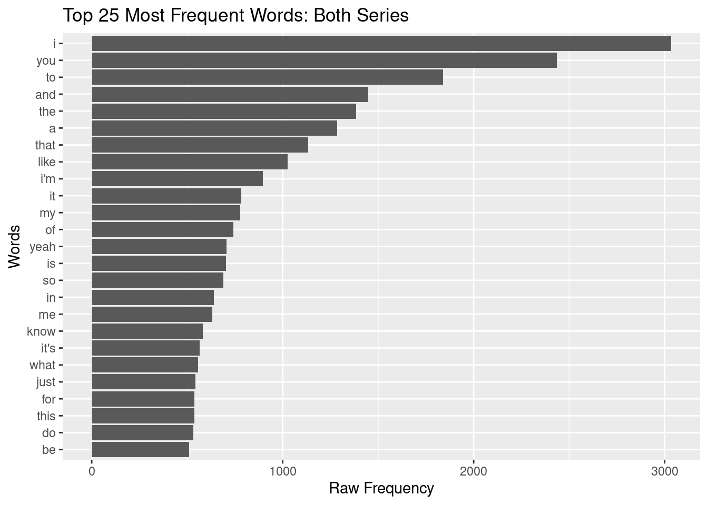
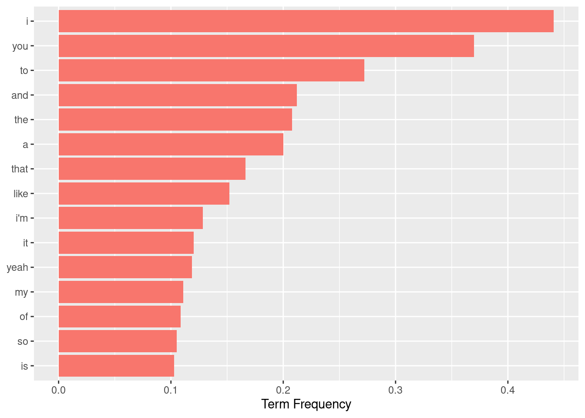
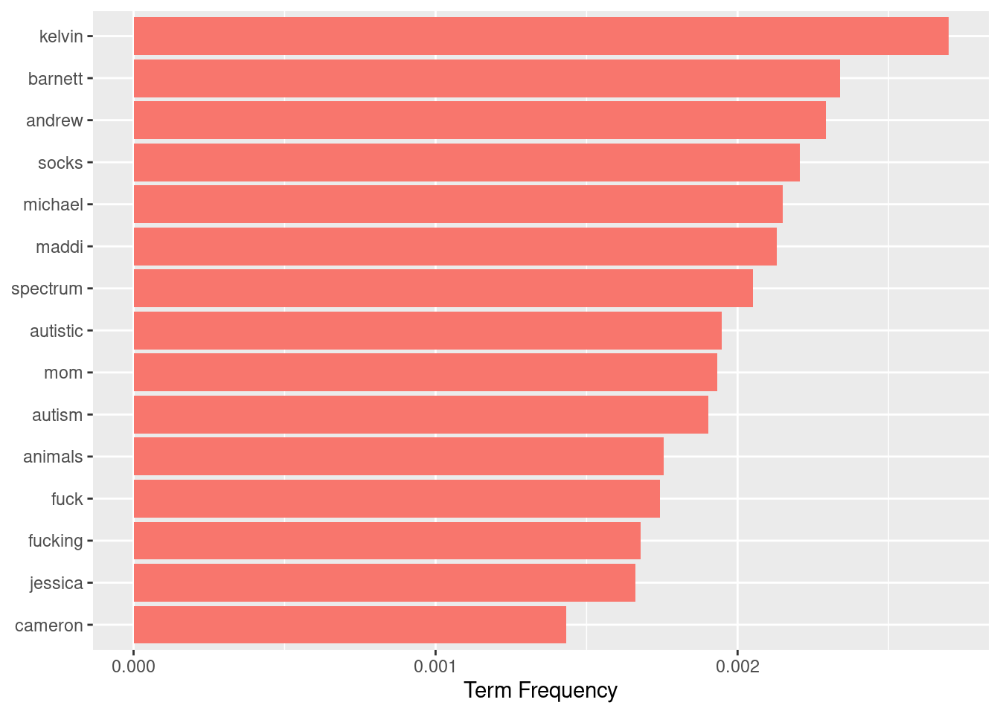
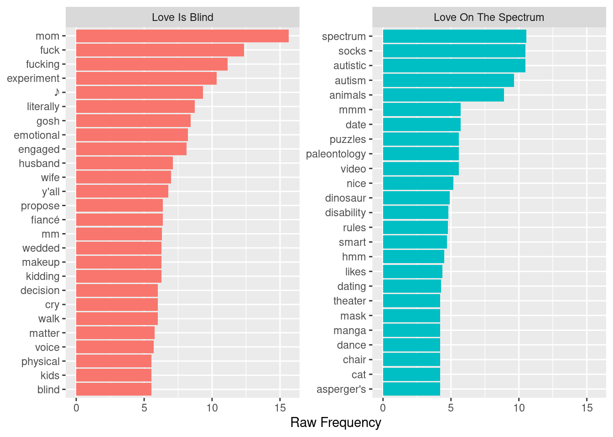
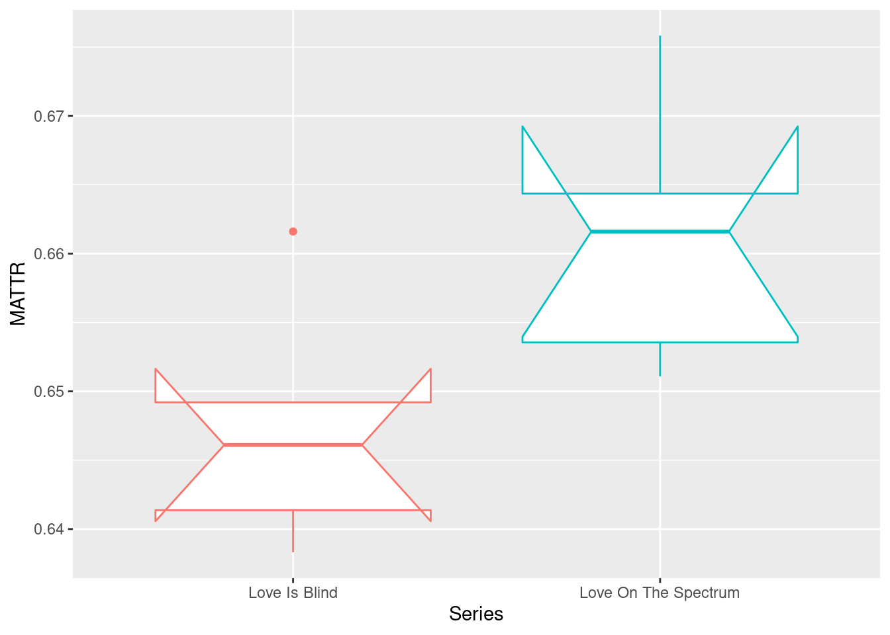
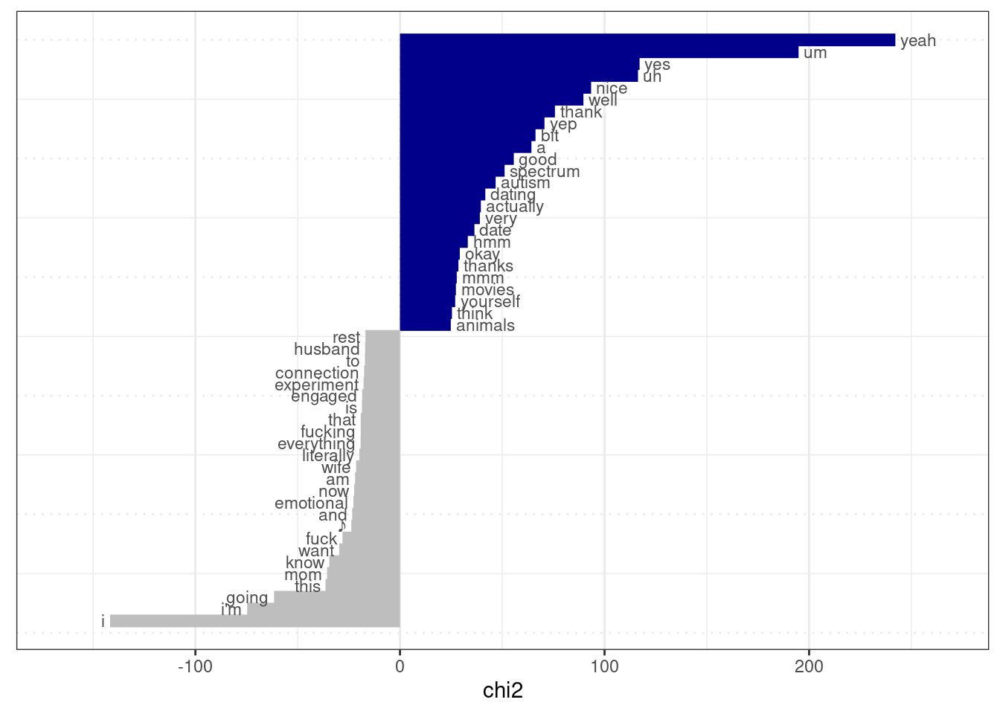
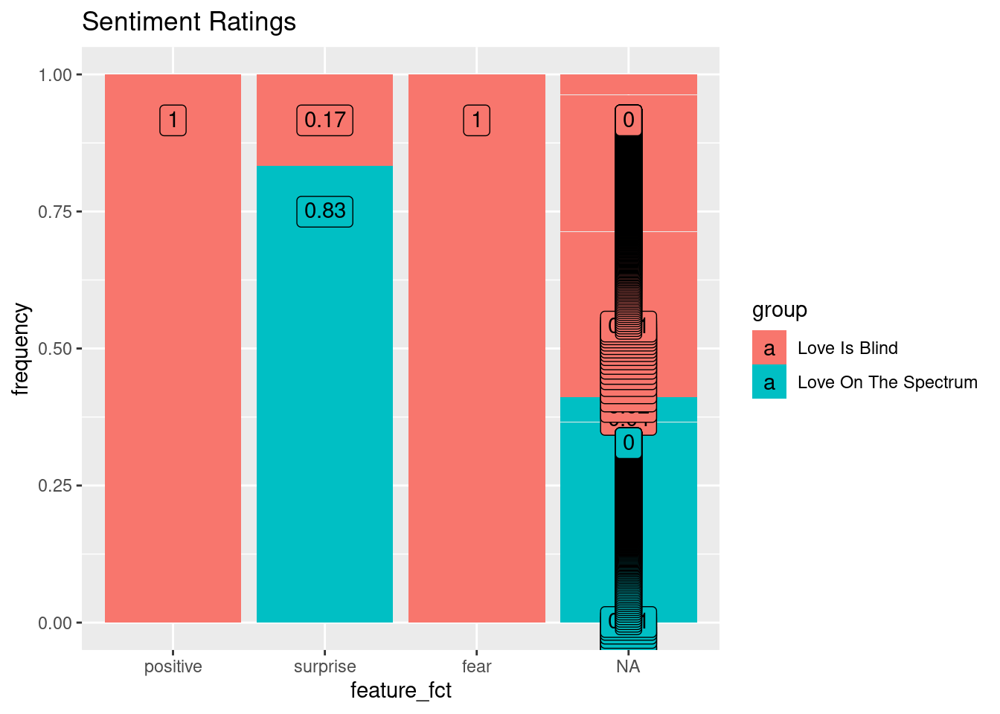

## About

### Description

The purpose of this script is to compare the two datasets, Love is Blind and Love on the Spectrum and find the differences between the two datasets and thus, the two groups of individuals (those on the Autism spectrum and those who are not). It is important to note that

We will start by doing a keyness contrast analysis by finding the relative frequency of words, then we will do a weighted frequency to determine how frequent a particular word is relative to the entire dialogue from the season. Next, we will look to determine whether or not there is lexical diversity between the two groups. Then, we will do a type-token analysis. Finally we will do topic modeling to show differences amongst different types of people and then the last step we plan to do is a sentiment analysis in order to find if there are different emotions that are expressed in the two different seasons.

It is important to note that though the two shows are about navigating the dating world, we do know that Love on the Spectrum and Love is Blind have different motives. Love on the Spectrum is more about following individuals around as they navigate looking and falling in love, whereas Love is Blind is more of a show based on competition and may be more scripted and less natural.

### Usage

<!-- How to run this script: what input it requires and output produced -->

## Setup


```r
# Script-specific options or packages

library(tidyverse)           # data manipulation
library(patchwork)           # organize plots
library(janitor)             # cross tabulations
library(tidytext)            # text operations
library(quanteda)            # tokenization and document-frequency matrices
library(quanteda.textstats)  # descriptive text statistics
library(quanteda.textmodels) # topic modeling
library(quanteda.textplots)  # plotting quanteda objects
```

## Run

In our transform stage, we combined the two datasets into one. Let's read in this combined datset.


```r
love <- read_csv(file = "../data/derived/love.csv")
```

Here, we see this is our new (combined) dataset because it has 10 rows.


```r
glimpse(love) # preview dataset 
```

```
## Rows: 10
## Columns: 4
## $ Series   <chr> "Love On The Spectrum", "Love On The Sp…
## $ Season   <chr> "01", "01", "01", "01", "01", "01", "01…
## $ Episode  <chr> "01", "02", "03", "04", "05", "01", "02…
## $ Dialogue <chr> "What do you think love is? It'll be li…
```

Let's take a look at the data dictionary to make sure we understand what each variable signifies (our variables are very straight forward, but I recommend this step regardless to make sure you know what each variable represents). We will only preview one data dictionary because both contain the same variables: Series, Season, Episode, and Dialogue.


```r
read_csv(file = "../data/derived/love_on_the_spectrum/love_on_the_spectrum_curated_data_dictionary.csv") # read data dictionary
```

```
## Rows: 4 Columns: 3
```

```
## ── Column specification ──────────────────────────────────
## Delimiter: ","
## chr (3): variable_name, variable, description
```

```
## 
## ℹ Use `spec()` to retrieve the full column specification for this data.
## ℹ Specify the column types or set `show_col_types = FALSE` to quiet this message.
```

<div data-pagedtable="false">
  <script data-pagedtable-source type="application/json">
{"columns":[{"label":["variable_name"],"name":[1],"type":["chr"],"align":["left"]},{"label":["variable"],"name":[2],"type":["chr"],"align":["left"]},{"label":["description"],"name":[3],"type":["chr"],"align":["left"]}],"data":[{"1":"Series","2":"Series","3":"The television series we are acquiring dataset from"},{"1":"Season","2":"Season","3":"The season of the tv show that our data comes from"},{"1":"Episode","2":"Episode","3":"The episode(s) that our data is from"},{"1":"Dialogue","2":"Dialogue","3":"The dialogue from each episode of the tv show"}],"options":{"columns":{"min":{},"max":[10]},"rows":{"min":[10],"max":[10]},"pages":{}}}
  </script>
</div>

### Word Frequency Analysis


```r
love_corpus <-
  love %>% # data frame
  corpus(text_field = "Dialogue")

love_corpus %>%
  summary(n = 5) # preview
```

<div data-pagedtable="false">
  <script data-pagedtable-source type="application/json">
{"columns":[{"label":[""],"name":["_rn_"],"type":[""],"align":["left"]},{"label":["Text"],"name":[1],"type":["chr"],"align":["left"]},{"label":["Types"],"name":[2],"type":["int"],"align":["right"]},{"label":["Tokens"],"name":[3],"type":["int"],"align":["right"]},{"label":["Sentences"],"name":[4],"type":["int"],"align":["right"]},{"label":["Series"],"name":[5],"type":["chr"],"align":["left"]},{"label":["Season"],"name":[6],"type":["chr"],"align":["left"]},{"label":["Episode"],"name":[7],"type":["chr"],"align":["left"]}],"data":[{"1":"text1","2":"1316","3":"8063","4":"1049","5":"Love On The Spectrum","6":"01","7":"01","_rn_":"1"},{"1":"text2","2":"1120","3":"7440","4":"1153","5":"Love On The Spectrum","6":"01","7":"02","_rn_":"2"},{"1":"text3","2":"1221","3":"7917","4":"1103","5":"Love On The Spectrum","6":"01","7":"03","_rn_":"3"},{"1":"text4","2":"1172","3":"6910","4":"904","5":"Love On The Spectrum","6":"01","7":"04","_rn_":"4"},{"1":"text5","2":"1038","3":"6810","4":"974","5":"Love On The Spectrum","6":"01","7":"05","_rn_":"5"}],"options":{"columns":{"min":{},"max":[10]},"rows":{"min":[10],"max":[10]},"pages":{}}}
  </script>
</div>

This code chunk allow us to see the type-tokens for each episode in the seasons for Love on the Spectrum and Love is Blind.


```r
love_tokens <-
  love_corpus %>% # corpus object
  tokens(what = "word", # tokenize by word
         remove_punct = TRUE) %>% # remove punctuation
  tokens_tolower() # lowercase tokens


love_tokens %>%
  head(n = 1) # preview one tokenized documents.
```

```
## Tokens consisting of 1 document and 3 docvars.
## text1 :
##  [1] "what"  "do"    "you"   "think" "love"  "is"   
##  [7] "it'll" "be"    "like"  "a"     "fairy" "tale" 
## [ ... and 5,953 more ]
```

This shows us each of the tokens, which we organize by word, of each series.


```r
love_dfm <-
  love_tokens %>%
  dfm() # create dfm

love_dfm %>% # data frequency model for love on the spectrum
  head(n = 5) # preview 5 documents
```

```
## Document-feature matrix of: 5 documents, 4,122 features (75.36% sparse) and 3 docvars.
##        features
## docs    what do you think love is it'll be like   a
##   text1   47 63 206    27   27 48     2 55   70 173
##   text2   63 57 260    31   19 60     3 34   69 108
##   text3   69 74 233    42   19 50     2 37   93 147
##   text4   21 37 174    27   21 45     3 29   55 121
##   text5   41 68 189    31   10 27     0 20   72 113
## [ reached max_nfeat ... 4,112 more features ]
```

This data frequency model shows the first 10 words of the transcripts from 5 of the 10 episodes (docs). Under each word, it shows its frequency in each of the 5 episodes we are previewing. We see there is a 75.3% sparsity, which indicates there are a number of zeros throughout the dataset for the features. There are 4,122 features total in the 5 documents.

We are now going to look at the top 25 words from the combined dataset.


```r
love_dfm %>%
  textstat_frequency() %>%
  slice_head(n = 10)
```

<div data-pagedtable="false">
  <script data-pagedtable-source type="application/json">
{"columns":[{"label":[""],"name":["_rn_"],"type":[""],"align":["left"]},{"label":["feature"],"name":[1],"type":["chr"],"align":["left"]},{"label":["frequency"],"name":[2],"type":["dbl"],"align":["right"]},{"label":["rank"],"name":[3],"type":["dbl"],"align":["right"]},{"label":["docfreq"],"name":[4],"type":["dbl"],"align":["right"]},{"label":["group"],"name":[5],"type":["chr"],"align":["left"]}],"data":[{"1":"i","2":"3035","3":"1","4":"10","5":"all","_rn_":"1"},{"1":"you","2":"2435","3":"2","4":"10","5":"all","_rn_":"2"},{"1":"to","2":"1839","3":"3","4":"10","5":"all","_rn_":"3"},{"1":"and","2":"1449","3":"4","4":"10","5":"all","_rn_":"4"},{"1":"the","2":"1385","3":"5","4":"10","5":"all","_rn_":"5"},{"1":"a","2":"1286","3":"6","4":"10","5":"all","_rn_":"6"},{"1":"that","2":"1133","3":"7","4":"10","5":"all","_rn_":"7"},{"1":"like","2":"1027","3":"8","4":"10","5":"all","_rn_":"8"},{"1":"i'm","2":"895","3":"9","4":"10","5":"all","_rn_":"9"},{"1":"it","2":"782","3":"10","4":"10","5":"all","_rn_":"10"}],"options":{"columns":{"min":{},"max":[10]},"rows":{"min":[10],"max":[10]},"pages":{}}}
  </script>
</div>

This list encompasses the top 10 words from each of the documents (episodes). We see that these words are common words that are used in everyday language use.

We are now going to use this data frame to plot the frequencies of the terms in descending order for the dataset (the top 25 words).

```{=html}
<!-- JF: 
Note: your title needs updating as this now is for both series
-->
```


```r
love_dfm %>%
  textstat_frequency() %>%
  slice_head(n = 25) %>%
  ggplot(aes(x = reorder(feature, frequency), y = frequency)) + geom_col() + coord_flip() + labs(x = "Words", y = "Raw Frequency", title = "Top 25 Most Frequent Words: Both Series")
```



The raw frequency of each word in each dataset is affected by the total number of words in each series dataset. In order to make a term-series comparison, we will now use the dfm_weight() function which will determine the Term (weighted) frequency of the words by determining how frequent a term in an episode is to the rest of the episode.


```r
love_dfm %>% # dfm
  dfm_weight(scheme = "prop") %>% # weigh by term frequency
  textstat_frequency() %>%
  group_by(group) %>% #grouping parameters
  slice_max(frequency, n = 15) %>% # extract top features
  ungroup() %>% # remove grouping parameters
  ggplot(aes(x = frequency, y = reorder_within(feature, frequency, group), fill = group)) +
  geom_col (show.legend = FALSE) + # barplot
  scale_y_reordered() + # clean up y-axis labels (features)
  labs(x = "Term Frequency", y = NULL) # labels
```



We see the use of the words "I" and "You" are used very frequently, much more than the rest of the words.

The issue we now have is that the words in the term frequency matrix is that the top 15 words appear to be terms that are the bread and butter across language-- they are extremely common. In order to find the words that distinguish (if they do) one series from another, we must apply the Term Frequency-Inverse Document Frequency to put the most common words at the bottom of the chart because they are most frequent across all the documents, and put the next set of words that aren't as common as the most frequent.


```r
love_dfm%>%
  dfm_trim(min_docfreq = 2) %>% # keep terms appearing in 2 or more episodes
  dfm_tfidf(scheme_tf = "prop") %>% # weigh by tf-idf
  textstat_frequency(force = TRUE) %>% # get frequency statistics
  group_by(group) %>% #grouping parameters
  slice_max(frequency, n = 15) %>% # extract top features
  ungroup() %>% # remove grouping parameters
  ggplot(aes(x = frequency, y = reorder_within(feature, frequency, group), fill = group)) +
  geom_col (show.legend = FALSE) + # barplot
  scale_y_reordered() + # clean up y-axis labels (features)
  labs(x = "Term Frequency", y = NULL) # labels
```



After minimizing the effect of common words, we are now able to see the "meat" of the data and which words are used most frequently across the episodes. We see there are a lot of names that appear. We see no words relating to romantic relationships, but we do see explicits as well as references to autism and the spectrum.

Since the shows are dating shows and both reality shows in a sense, it makes sense that names are very common throughout the shows. However, this is distracting and doesn't allow us to really analyze whether we see patterns in the most frequent words.

Let's look at loading in and using the `babynames` dataset in order to eliminate the names we see listed above and look at the true content of the dataset.


```r
first_names <- 
  babynames::babynames %>% # babynames data frame
  distinct(name) %>% # get unique names
  pull(name) %>% # pull names into character vector
  str_to_lower() # lowercase all names

love_content_tokens <- 
  love_tokens %>% # original tokens object
  tokens_remove(first_names) # remove names in `first_names`

love_content_dfm <- 
  love_content_tokens %>% 
  dfm()

love_content_dfm %>% 
  dfm_tfidf() %>% 
  dfm_trim(min_docfreq = 2) %>% 
  textstat_frequency(groups = Series, force = TRUE) %>% 
  group_by(group) %>% 
  slice_max(frequency, n = 25) %>% 
  ungroup() %>% 
  ggplot(aes(x = frequency, y = reorder_within(feature, frequency, group), fill = group)) +
  geom_col(show.legend = FALSE) +
  scale_y_reordered() +
  facet_wrap(~group, scales = "free_y") +
  labs(x = "Raw Frequency", y = NULL)
```

```
## Warning in dfm_trim.dfm(., min_docfreq = 2): dfm has been
## previously weighted
```



After eliminating all the names that took appeared in the top 15 word frequency, we are finally able to look at the meat of the dataset. We are also able to compare the raw frequency of the top 25 words of both Series. We see for the Love is Blind series, we see explicits are said quite frequently, but we also see words that reference love and romantic relationships like engaged, husband, wife, propose, fiancé, wedded, and kids.

For the Love on the Spectrum series, there are a lot of references to Austism (autistic, autism, spectrum, asperger's, disability) and words that are "nerdy" (puzzles, palentology, dinosaur, manga, smart). There are only two words in the top 25 that refer to romantic relationships: dating and date.

### Type-Token Ratio

The purpose of obtaining a type-token ratio is to explore term usage in and across documents (in our case, across the two different series). We are looking at each unique term (type) and comparing it ot thte total number of terms in the document (tokens). We use the MATTR command in this portion of the script because we want to mitigate the issue of TTR, which is biased when comparing documents with different in the total number of tokens.


```r
love_lexdiv <- 
  love_content_tokens %>% 
  textstat_lexdiv(measure = "MATTR", MATTR_window = 100)
```

```{=html}
<!-- JF:

You were trying to cbind the love_corpus object with the love_lexdiv object --and you need to combine the metadata (docvars) from the love_content_tokens object.
-->
```


```r
love_tokens_meta <- love_content_tokens %>% docvars() # pull docvars from tokens object
love_lexdiv_meta <- cbind(love_tokens_meta, love_lexdiv) # combine
```


```r
love_lexdiv_meta %>%
  ggplot(aes(x = reorder(Series, MATTR), y = MATTR, color = Series)) +
  geom_boxplot(notch = TRUE, show.legend = FALSE) +
  labs(x = "Series")
```

```
## notch went outside hinges. Try setting notch=FALSE.
## notch went outside hinges. Try setting notch=FALSE.
```



We know that for MATTR (Moving-Average Type-Token Ratio), larger numbers represent a more diverse lexicon and more diversity in words, whereas smaller numbers indicate more repetition. This plot shows that there is more diversity in words in Love on the Spectrum, which is contrary to what we hypothesized; we believed that the individuals on *Love on the Spedtrum* used more common and basic words and that there would be more repetition in their transcripts.

### Relative Frequency (Keyness) Measures

The purpose of exploring the relative frequencies of the terms in both TV Series is to compare these terms to one another. One group becomes the target group and the other becomes the reference group. The results will show us which terms occur significantly more often in the target group than they do in the reference group.


```r
love_content_keywords <-
  love_content_dfm %>% # dfm
  dfm_trim(min_docfreq = 2) %>% # keep terms appearing in 2 or more episodes
  textstat_keyness(target = love_content_dfm$Series == "Love On The Spectrum")  # compare to Love Is Blind

love_content_keywords %>% 
  textplot_keyness(show_legend = FALSE, n = 25, labelsize = 3)
```

```
## Warning: It is deprecated to specify `guide = FALSE` to
## remove a guide. Please use `guide = "none"` instead.
```



The purpose of this relative frequency graph is to show us the top 25 most frequent words in a target group (Love on the Spectrum) and compares it to the top 25 most frequent words in the reference group (Love is Blind). We see that for Love on the Spectrum, there are a lot of backchannel markers (yeah, um, yes, uh, nice, well, yep, hmm, mmm, and okay) which are probably used as interjections when another is talking.

We also see that "yeah" and "um" occur quite frequently, even more frequent than the most frequent word in Love is Blind, "I". This could also reiterate the idea above.

For Love is Blind, we see more explicits and we also see words that refer to romantic relationships with references to the words husband, connection, engaged, and wife.

### Topic Modeling


```r
library(seededlda) # for the Latent Dirichlet Allocation Algorithm
```


```r
love_lda <- textmodel_lda(love_content_dfm, k = 5)

terms(love_lda, 10) # top 10 terms for each topic
```

```
##       topic1     topic2       topic3     topic4 topic5 
##  [1,] "mom"      "going"      "really"   "i"    "yeah" 
##  [2,] "home"     "everything" "hello"    "to"   "a"    
##  [3,] "house"    "wife"       "date"     "and"  "um"   
##  [4,] "weeks"    "♪"          "who's"    "that" "yes"  
##  [5,] "close"    "emotional"  "favorite" "a"    "uh"   
##  [6,] "well"     "fuck"       "school"   "i'm"  "well" 
##  [7,] "place"    "crazy"      "cute"     "of"   "good" 
##  [8,] "back"     "rest"       "boys"     "is"   "nice" 
##  [9,] "while"    "thank"      "how"      "it"   "thank"
## [10,] "birthday" "married"    "yeah"     "know" "think"
```

There don't seem to any clear topics among the group of words, however we are able to make some connections. For topic two, there are words like yeah, um, yes, good, okay, uh, and well. This goes back to the keyness measure analysis, which showed us how most of the words from Love on the Spectrum were backchannel words. We see this same pattern here. For topic 3, three words stand out: autistic, disabilities, and asperger's. These words instantly draw your attention, so I would say this is the topic for topic 3.

### Sentiment Analysis

We will do a sentiment analysis in order to see if there are certain kinds of emotions that may or may not be associated with each of series. Are the sentiments related to *Love on the Spectrum* more sad and depressing? Do they see their disability as something that holds them back and thus has negative sentiments related to it? Moreover, are there more happy and loving sentiments related to *Love is Blind*? Because they have less difficulty interacting with others and engaging in romantic relationships, are the sentiments in this show more positive?


```r
sentiment_dictionary <-
  textdata::lexicon_nrc() %>% # load the nrc lexicon
  as.dictionary() # convert the data frame to a dictionary object
```


```r
love_sentiment <-
  love_content_tokens %>%
  tokens_lookup(dictionary = sentiment_dictionary) # add sentiment labels
```

We will be using the Word-Emotion Association Lexicon by Mohammad and Turney (2013) in order to see the emotions associated with the words in each series [@mohammad2013].


```r
love_content_tokens %>%
  dfm() %>% # create dfm
  textstat_frequency(groups = Series) %>% # generate frequency
  mutate(feature_fct = factor(feature, levels = c("positive", "joy", "trust", "anticipation", "surprise", "negative", "frustration", "anger", "fear", "disgust", "sadness"))) %>% # reorder features from positive to negative
  group_by(feature_fct) %>% # grouping parameter
  mutate(prop = round(frequency/sum(frequency), 2)) %>% # create proportions scores
  ggplot(aes(x = feature_fct, y = frequency, fill = group, label = paste0(prop))) + # mappings
  geom_bar(stat = "identity", position = "fill") + # proportion bar plot
  geom_label(position = "fill", vjust = 2) + # add proportion labels
  labs(title = "Sentiment Ratings")
```




## Finalize

### Log

The analysis of the transcripts from Love on the Spectrum and Love is Blind was to provide us with insight on if differences in language occur, especially surrounding the topic of love. Previous research has shown that individuals with Autism Spectrum Disorder often have a difficult time in maintaining relationships, especially romantic ones [@strunz2017].

Our purpose is to investigate whether or not we see differences in word frequency (due to a common characteristic of autism being *echolalia*, the repetition of the speech of others) [@sterponi2014]. Due to this common characteristic, we were hoping to find patterns in the Love on the Spectrum data to validate this hypothesis, however it does not appear that words indicative of repetition (questioning why if someone asks why, etc.) occur in this data.

We also wished to investigate which words were more common in each dataset. We found that word names seemed to appear most often when controlling for common words expressed in everyday language use and for Love is Blind, we found words indicative of relationships and romance. Next, we looked at sentiments and topics surrounding each of the TV Series and we didn't find anything indicative that romance was more of a topic in Love is Blind than in Love on the Spectrum. Instead, the only theme that seemed to appear in the Love on the Spectrum topics were the use of common words. We also see that their word choice across topics is very basic, which is also a characteristic of autism; their word choice compared to typically-developed adults is simpler. For the Love is Blind topics, we found the common words topic like we did in Love on the Spectrum, but we also saw the topic of home, which either shows that individuals talked about their lives growing up, or talked about their lives together. Again, however, we did not find that romance was a topic that was more discussed in Love is Blind than in Love on the Spectrum.

We did further investigation on whether or not we see echolalia in individuals on the spectrum by focusing on the Type-Token Ratio.

Finally, we wanted to investigate whether or not individuals on the spectrum had a smaller vocabulary than those not on the spectrum, and their use of very common words like you, I, yeah, like, etc.

\*\*\* for some reason, my citations will not show up when I put the \@ symbol. Went in to make sure zotero key was there, it was. Cleared out and re-entered, reapplied, and hit ok. Still did not work.

### Session

<details>

<summary>

View session information

</summary>


<div data-pagedtable="false">
  <script data-pagedtable-source type="application/json">
{"columns":[{"label":[""],"name":["_rn_"],"type":[""],"align":["left"]},{"label":["package"],"name":[1],"type":["chr"],"align":["left"]},{"label":["ondiskversion"],"name":[2],"type":["chr"],"align":["left"]},{"label":["loadedversion"],"name":[3],"type":["chr"],"align":["left"]},{"label":["path"],"name":[4],"type":["chr"],"align":["left"]},{"label":["loadedpath"],"name":[5],"type":["chr"],"align":["left"]},{"label":["attached"],"name":[6],"type":["lgl"],"align":["right"]},{"label":["is_base"],"name":[7],"type":["lgl"],"align":["right"]},{"label":["date"],"name":[8],"type":["chr"],"align":["left"]},{"label":["source"],"name":[9],"type":["chr"],"align":["left"]},{"label":["md5ok"],"name":[10],"type":["lgl"],"align":["right"]},{"label":["library"],"name":[11],"type":["fct"],"align":["left"]}],"data":[{"1":"citr","2":"0.3.2","3":"0.3.2","4":"/cloud/lib/x86_64-pc-linux-gnu-library/4.1/citr","5":"/cloud/lib/x86_64-pc-linux-gnu-library/4.1/citr","6":"TRUE","7":"FALSE","8":"2021-08-20","9":"Github (crsh/citr@0e8243d)","10":"NA","11":"/cloud/lib/x86_64-pc-linux-gnu-library/4.1","_rn_":"citr"},{"1":"dplyr","2":"1.0.7","3":"1.0.7","4":"/cloud/lib/x86_64-pc-linux-gnu-library/4.1/dplyr","5":"/cloud/lib/x86_64-pc-linux-gnu-library/4.1/dplyr","6":"TRUE","7":"FALSE","8":"2021-06-18","9":"RSPM (R 4.1.0)","10":"NA","11":"/cloud/lib/x86_64-pc-linux-gnu-library/4.1","_rn_":"dplyr"},{"1":"forcats","2":"0.5.1","3":"0.5.1","4":"/cloud/lib/x86_64-pc-linux-gnu-library/4.1/forcats","5":"/cloud/lib/x86_64-pc-linux-gnu-library/4.1/forcats","6":"TRUE","7":"FALSE","8":"2021-01-27","9":"RSPM (R 4.1.0)","10":"NA","11":"/cloud/lib/x86_64-pc-linux-gnu-library/4.1","_rn_":"forcats"},{"1":"ggplot2","2":"3.3.5","3":"3.3.5","4":"/cloud/lib/x86_64-pc-linux-gnu-library/4.1/ggplot2","5":"/cloud/lib/x86_64-pc-linux-gnu-library/4.1/ggplot2","6":"TRUE","7":"FALSE","8":"2021-06-25","9":"RSPM (R 4.1.0)","10":"NA","11":"/cloud/lib/x86_64-pc-linux-gnu-library/4.1","_rn_":"ggplot2"},{"1":"janitor","2":"2.1.0","3":"2.1.0","4":"/cloud/lib/x86_64-pc-linux-gnu-library/4.1/janitor","5":"/cloud/lib/x86_64-pc-linux-gnu-library/4.1/janitor","6":"TRUE","7":"FALSE","8":"2021-01-05","9":"RSPM (R 4.1.0)","10":"NA","11":"/cloud/lib/x86_64-pc-linux-gnu-library/4.1","_rn_":"janitor"},{"1":"knitr","2":"1.34","3":"1.34","4":"/cloud/lib/x86_64-pc-linux-gnu-library/4.1/knitr","5":"/cloud/lib/x86_64-pc-linux-gnu-library/4.1/knitr","6":"TRUE","7":"FALSE","8":"2021-09-09","9":"RSPM (R 4.1.0)","10":"NA","11":"/cloud/lib/x86_64-pc-linux-gnu-library/4.1","_rn_":"knitr"},{"1":"pacman","2":"0.5.1","3":"0.5.1","4":"/cloud/lib/x86_64-pc-linux-gnu-library/4.1/pacman","5":"/cloud/lib/x86_64-pc-linux-gnu-library/4.1/pacman","6":"TRUE","7":"FALSE","8":"2019-03-11","9":"RSPM (R 4.1.0)","10":"NA","11":"/cloud/lib/x86_64-pc-linux-gnu-library/4.1","_rn_":"pacman"},{"1":"patchwork","2":"1.1.1","3":"1.1.1","4":"/cloud/lib/x86_64-pc-linux-gnu-library/4.1/patchwork","5":"/cloud/lib/x86_64-pc-linux-gnu-library/4.1/patchwork","6":"TRUE","7":"FALSE","8":"2020-12-17","9":"RSPM (R 4.1.0)","10":"NA","11":"/cloud/lib/x86_64-pc-linux-gnu-library/4.1","_rn_":"patchwork"},{"1":"purrr","2":"0.3.4","3":"0.3.4","4":"/cloud/lib/x86_64-pc-linux-gnu-library/4.1/purrr","5":"/cloud/lib/x86_64-pc-linux-gnu-library/4.1/purrr","6":"TRUE","7":"FALSE","8":"2020-04-17","9":"RSPM (R 4.1.0)","10":"NA","11":"/cloud/lib/x86_64-pc-linux-gnu-library/4.1","_rn_":"purrr"},{"1":"quanteda","2":"3.1.0","3":"3.1.0","4":"/cloud/lib/x86_64-pc-linux-gnu-library/4.1/quanteda","5":"/cloud/lib/x86_64-pc-linux-gnu-library/4.1/quanteda","6":"TRUE","7":"FALSE","8":"2021-08-17","9":"RSPM (R 4.1.0)","10":"NA","11":"/cloud/lib/x86_64-pc-linux-gnu-library/4.1","_rn_":"quanteda"},{"1":"quanteda.textmodels","2":"0.9.4","3":"0.9.4","4":"/cloud/lib/x86_64-pc-linux-gnu-library/4.1/quanteda.textmodels","5":"/cloud/lib/x86_64-pc-linux-gnu-library/4.1/quanteda.textmodels","6":"TRUE","7":"FALSE","8":"2021-04-06","9":"RSPM (R 4.1.0)","10":"NA","11":"/cloud/lib/x86_64-pc-linux-gnu-library/4.1","_rn_":"quanteda.textmodels"},{"1":"quanteda.textplots","2":"0.94","3":"0.94","4":"/cloud/lib/x86_64-pc-linux-gnu-library/4.1/quanteda.textplots","5":"/cloud/lib/x86_64-pc-linux-gnu-library/4.1/quanteda.textplots","6":"TRUE","7":"FALSE","8":"2021-04-06","9":"RSPM (R 4.1.0)","10":"NA","11":"/cloud/lib/x86_64-pc-linux-gnu-library/4.1","_rn_":"quanteda.textplots"},{"1":"quanteda.textstats","2":"0.94.1","3":"0.94.1","4":"/cloud/lib/x86_64-pc-linux-gnu-library/4.1/quanteda.textstats","5":"/cloud/lib/x86_64-pc-linux-gnu-library/4.1/quanteda.textstats","6":"TRUE","7":"FALSE","8":"2021-05-11","9":"RSPM (R 4.1.0)","10":"NA","11":"/cloud/lib/x86_64-pc-linux-gnu-library/4.1","_rn_":"quanteda.textstats"},{"1":"readr","2":"2.0.1","3":"2.0.1","4":"/cloud/lib/x86_64-pc-linux-gnu-library/4.1/readr","5":"/cloud/lib/x86_64-pc-linux-gnu-library/4.1/readr","6":"TRUE","7":"FALSE","8":"2021-08-10","9":"RSPM (R 4.1.0)","10":"NA","11":"/cloud/lib/x86_64-pc-linux-gnu-library/4.1","_rn_":"readr"},{"1":"readtext","2":"0.81","3":"0.81","4":"/cloud/lib/x86_64-pc-linux-gnu-library/4.1/readtext","5":"/cloud/lib/x86_64-pc-linux-gnu-library/4.1/readtext","6":"TRUE","7":"FALSE","8":"2021-07-14","9":"RSPM (R 4.1.0)","10":"NA","11":"/cloud/lib/x86_64-pc-linux-gnu-library/4.1","_rn_":"readtext"},{"1":"rmarkdown","2":"2.11","3":"2.11","4":"/cloud/lib/x86_64-pc-linux-gnu-library/4.1/rmarkdown","5":"/cloud/lib/x86_64-pc-linux-gnu-library/4.1/rmarkdown","6":"TRUE","7":"FALSE","8":"2021-09-14","9":"CRAN (R 4.1.0)","10":"NA","11":"/cloud/lib/x86_64-pc-linux-gnu-library/4.1","_rn_":"rmarkdown"},{"1":"seededlda","2":"0.6.0","3":"0.6.0","4":"/cloud/lib/x86_64-pc-linux-gnu-library/4.1/seededlda","5":"/cloud/lib/x86_64-pc-linux-gnu-library/4.1/seededlda","6":"TRUE","7":"FALSE","8":"2021-04-08","9":"RSPM (R 4.1.2)","10":"NA","11":"/cloud/lib/x86_64-pc-linux-gnu-library/4.1","_rn_":"seededlda"},{"1":"sessioninfo","2":"1.1.1","3":"1.1.1","4":"/cloud/lib/x86_64-pc-linux-gnu-library/4.1/sessioninfo","5":"/cloud/lib/x86_64-pc-linux-gnu-library/4.1/sessioninfo","6":"TRUE","7":"FALSE","8":"2018-11-05","9":"RSPM (R 4.1.0)","10":"NA","11":"/cloud/lib/x86_64-pc-linux-gnu-library/4.1","_rn_":"sessioninfo"},{"1":"stringr","2":"1.4.0","3":"1.4.0","4":"/cloud/lib/x86_64-pc-linux-gnu-library/4.1/stringr","5":"/cloud/lib/x86_64-pc-linux-gnu-library/4.1/stringr","6":"TRUE","7":"FALSE","8":"2019-02-10","9":"RSPM (R 4.1.0)","10":"NA","11":"/cloud/lib/x86_64-pc-linux-gnu-library/4.1","_rn_":"stringr"},{"1":"tibble","2":"3.1.4","3":"3.1.4","4":"/cloud/lib/x86_64-pc-linux-gnu-library/4.1/tibble","5":"/cloud/lib/x86_64-pc-linux-gnu-library/4.1/tibble","6":"TRUE","7":"FALSE","8":"2021-08-25","9":"CRAN (R 4.1.0)","10":"NA","11":"/cloud/lib/x86_64-pc-linux-gnu-library/4.1","_rn_":"tibble"},{"1":"tidyr","2":"1.1.3","3":"1.1.3","4":"/cloud/lib/x86_64-pc-linux-gnu-library/4.1/tidyr","5":"/cloud/lib/x86_64-pc-linux-gnu-library/4.1/tidyr","6":"TRUE","7":"FALSE","8":"2021-03-03","9":"RSPM (R 4.1.0)","10":"NA","11":"/cloud/lib/x86_64-pc-linux-gnu-library/4.1","_rn_":"tidyr"},{"1":"tidytext","2":"0.3.1","3":"0.3.1","4":"/cloud/lib/x86_64-pc-linux-gnu-library/4.1/tidytext","5":"/cloud/lib/x86_64-pc-linux-gnu-library/4.1/tidytext","6":"TRUE","7":"FALSE","8":"2021-04-10","9":"RSPM (R 4.1.0)","10":"NA","11":"/cloud/lib/x86_64-pc-linux-gnu-library/4.1","_rn_":"tidytext"},{"1":"tidyverse","2":"1.3.1","3":"1.3.1","4":"/cloud/lib/x86_64-pc-linux-gnu-library/4.1/tidyverse","5":"/cloud/lib/x86_64-pc-linux-gnu-library/4.1/tidyverse","6":"TRUE","7":"FALSE","8":"2021-04-15","9":"RSPM (R 4.1.0)","10":"NA","11":"/cloud/lib/x86_64-pc-linux-gnu-library/4.1","_rn_":"tidyverse"}],"options":{"columns":{"min":{},"max":[10]},"rows":{"min":[10],"max":[10]},"pages":{}}}
  </script>
</div>


</details>

## References
